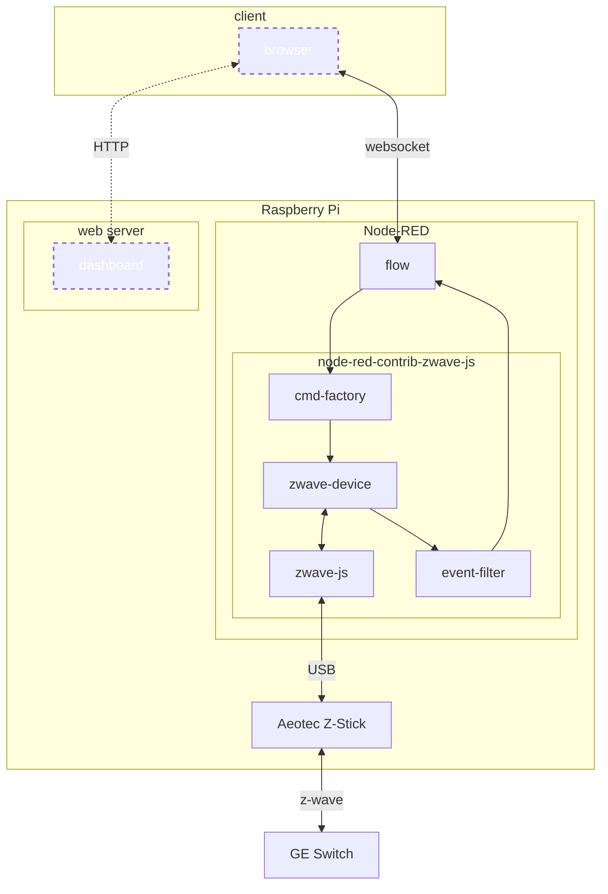

# Z-Wave in Node-RED using node-red-contrib-zwave-js

## About

Demonstrate <https://flows.nodered.org/node/node-red-contrib-zwave-js> to
control a _Z-Wave_-enabled switch using a USB-based _Z-Wave_ controller.

## Hardware

* Raspberry Pi 4
* Aeotec Z-Stick 7
* GE Enbrighten Outdoor Switch

## Software

* Raspberry Pi OS (bookworm)
* Node
* Node-RED
* node-red-contrib-zwave-js

## Details

[The dashed and dotted elements in the preceding digram indicates components that are simulated in this example flow using inject and debug nodes.]