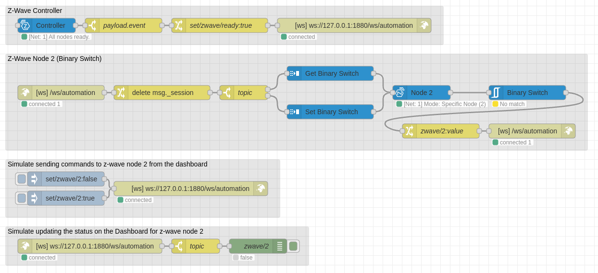
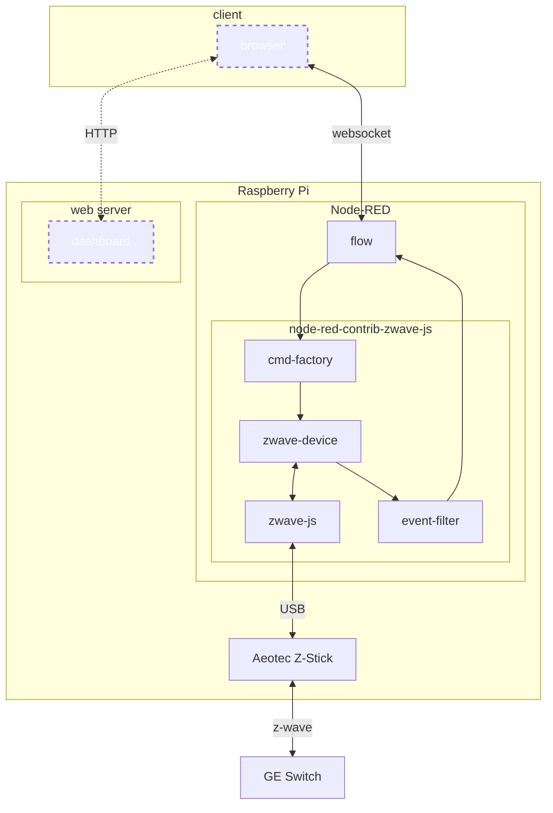
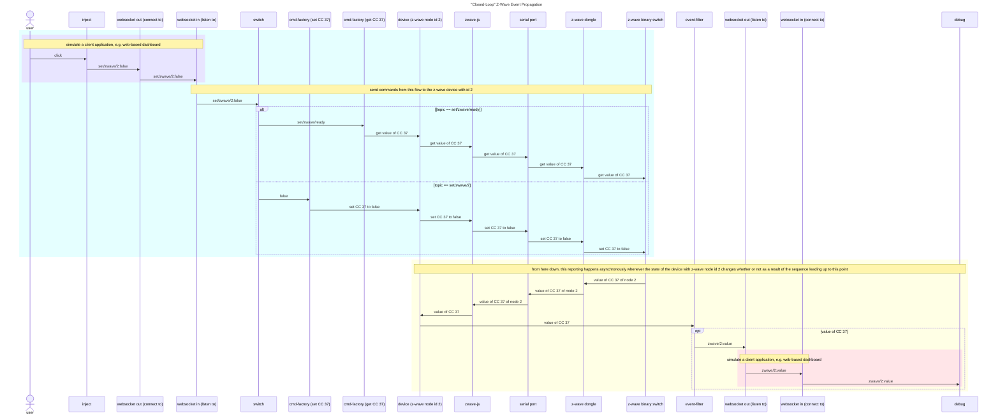

# Z-Wave in Node-RED Using _node-red-contrib-zwave-js_

[Note: all links on this page were working as of December 15, 2023.]



## About

Demonstrate using
[node_red-contrib-zwave-js](<https://flows.nodered.org/node/node-red-contrib-zwave-js>)
to control a _Z-Wave_-enabled switch using a USB-based Z-Wave controller.

* Connect to the controller using a _Zwave Controller_ node

* Send commands to control the state of a binary switch (command class 37) using
  a combination of _CMD Factor7_ and _ZWave Device_ nodes

* Receive asynchronous events when the state of the binary switch changes using
  a combination of _ZWave Device_ and _Event Filter_ nodes

* Query current state of the binary switch at start-up using the output of the
  _ZWave Controller_ node

* Simulate integration with a dashboard or similar external component using a
  websocket

## Hardware

The hardware with which this flow was tested:

| Product                      | URL                                                                    |
|------------------------------|------------------------------------------------------------------------|
| Raspberry Pi 4               | <https://www.raspberrypi.com/products/raspberry-pi-4-model-b/>         |
| Aeotec Z-Stick 7             | <https://aeotec.com/products/aeotec-z-stick-7/>                        |
| GE/Enbrighten Outdoor Switch | <https://enbrightenme.com/enbrighten-z-wave-plug-outdoor-smart-switch> |

Any computer suppoted by Node-RED should work. Any Z-Wave controller compatible
with _node-red-contrib-zwave-js_ should work, as should any Z-Wave device that
supports the Z-Wave binary switch (command class 37) protocol.

## Software

The versions of software with which this flow was tested:

| Component                         | URL                                                        |
|-----------------------------------|------------------------------------------------------------|
| Raspberry Pi OS (bookworm)        | <https://www.raspberrypi.com/software/>                    |
| Node (20.10.0)                    | <https://github.com/nodesource/distributions>              |
| Node-RED (3.1.3)                  | <https://nodered.org>                                      |
| node-red-contrib-zwave-js (9.0.3) | <https://flows.nodered.org/node/node-red-contrib-zwave-js> |

This flow does not rely on any _Node-RED_ 3.x features. Any version of Node-RED
that is supported by _node-red-contrib-zwave-js_ should work. Similarly, any
version of _Node_ supported by your version of _Node-RED_ should work.

## Background and Terminology

Z-Wave is mesh network protocol designed to support building automation and what
has come to be called the "Internet of Things" (IoT). The [Z-Wave
Alliance](https://z-wavealliance.org/) is a consortium of stakeholders which
defines the Z-Wave hardware and software specifications. Those specifictions
support a hardware ecosystem of "smart" lights, thermostats, sensors etc. which
can be monitored and controlled using standardized tools and platforms like
_Node-RED_, _Home Assistant_, _OpenHAB_ and so on.

Unfortuntely, both _Node-RED_ and the Z-Wave protocol use the term "node," but
to mean different things. A _Node-RED_ node is a small, self-contained software
component that can be added to _Node-RED_ flow. A Z-Wave node is an individual
piece of "smart" gear. Where the meaning of "node" is not obvious from context,
this document will qualify it; the phrase "_Node-RED_ node" refers to
_Node-RED_'s software component while "Z-Wave node" refers to a hardware device
that is part of a Z-Wave mesh network.

The Z-Wave specification includes a taxonomy of Z-Wave node types. A Z-Wave
network must include at least one controller node and any number of device
nodes. A controller node manages the process of adding (a.k.a. including) and
removing (a.k.a. excluding) nodes in the mesh network it controls. It also
provides a central communication hub for the network, though an important
feature of the Z-Wave protocol is the ability for devices to exchange messages
directly with one another rather than always having to route through a central
hub.

Each Z-Wave node is identified by an integer id assigned by the controller when
the node is first added to the mesh network. The Z-Wave specification also
supports metadata that describes the features and functions of each node. This
allows software like _Node-RED_ to query the nodes in a Z-Way network to
"discover" the nodes in a Z-Wave network and discern each device's type and
capabilities. Such discovery capabilities can be used, in principle, to build a
user interface for a Z-Wave network in a data-driven fashion that adapts
automatically as nodes are included and excluded over time. Since that requires
a very sophisticated run-time framework, most Z-Wave related packages for
systems like _Node-RED_ do not work that way. Instead, they provide some way for
users to "discover" Z-Wave nodes manually and map them to software components in
a more hard-coded fashion. The latter is the approach used by the
_node-red-contrib-zwave-js_ package, as described
[below](#interacting-with-a-z-wave-device).

Since the Z-Wave protocol has evolved over quite a number of years and is the
result of compromise between stakeholders with competing interests, it is
unfortunately rather complex with a number of redundancies. For example, any
given device can be monitored and controlled using either the "Command Classes"
(CC's) it supports or the "Value API." For a variety of historical reasons, you
will see wider use of CC's than the Value API in the real world of open source
software. This example flow relies on CC 37, i.e. the "binary switch" protocol
for devices can that have only a single, simple on / off state.

To summarize, the features demonstrated by this flow are:

* The ability communicate with Z-Wave nodes through a hard-coded reference to a
  particular controller node

* The ability to monitor and control a particular Z-Wave binary switch using a
  hard-coded reference to its Z-Wave node id and Command Class (CC).

To run this flow in your environment you will need a Z-Wave controller device
and a Z-Wave binary switch (i.e. a peice of Z-Wave gear that supports CC 37).
You must also modify the configuration of the
[_zwave-js_](#interacting-with-the-z-wave-controller) and
[_zwave-device_](#interacting-with-a-z-wave-device) _Node-RED_ nodes in this
flow, described below, to use the actual serial port device name and Z-Wave node
id of your gear.

## Details

The OS-assigned port for the Z-Wave controller was
`/dev/serial/by-id/usb-Silicon_Labs_CP2102N_USB_to_UART_Bridge_Controller_3a2938a76455ed11adc495131d62bc44-if00-port0`.
The Z-Wave controller assigned node id 2 to the binary switch when it was added
to the Z-Wave network. You will have to update the _ZWave Controller_ and _ZWave
Device_ nodes to match your Z-Wave network configuration.

Overall system architecture for this flow:



[The dashed and dotted elements in the preceding digram indicate interactions
and components that are simulated in this example flow using _inject_ and
_debug_ nodes.]

### WebSocket Based Event Driven Design

The overall approach used in this example is event-driven using a WebSocket.
[Websocket is used rather than MQTT both to make this example entirely
self-contained but, more importantly, for compatibility with browser-based web
applications e.g. a home automation user interface.] The flow listens for
commands to send to a _zwave-device_ node arriving at a _websocket in_ node and
sends the output of that _zwave-device_ node to a corresponding _websocket out_
node. Other components such as a home automation dashboard web application can
connect to that web socket to exchange messages with the _zwave-device_ as
demonstrated by the _inject_ and _debug_ nodes which do so within this flow.

The _zwave-device_ node responds asynchronously both to commands received from
the _websocket in_ listener node but also to state changes reported by the
_zwave-js_ node in the same flow. For example, you can use this flow to turn off
of the binary switch by clicking the `inject` whose payload is `false`. That
uses a `websocket out` node connected as a client to the WebSocket to which the
`websocket in` node whose output feeds the _zwave-device_ node is listening.
That message is sent through one of two _cmd-factory_ nodes based on its topic.
Messages whose topics are `set/zwave/2` are sent through a _cmd-factory_ node
that formats a Z-Wave command to set the value of a binary switch (command class
37) device. That properly formatted command message is then passed to the
_zwave-device_ node which uses the _zwave-js_ node in the same flow to tell the
Z-Wave controller to send the actual command over the Z-Wave wireless network.



When the Z-Wave device changes state, whether as a result of receiving a command
from this flow or by other operations within the Z-Wave network, it transmits a
status message which is received by the Z-Wave controller. That causes it to
emit a message from the serial port to which the _zwave-js_ node is listening.
That message is then forwarded to the output of the corresponding _zwave-device_
node and from there to an _event-filter_ node. The _event-filter_ only passes
through those messages which match its configuration. In this example, messages
which report the current value of the binary switch (command code 37) are
forwarded to the _websocket out_ node for processing by a client. For
demonstration purposes, this flow connects as a client to that WebSocket and
sends all such messages to a _debug_ node.

This can result in a slight but still noticable delay between sending a command
message and receiving one indicating the corresponding change of device state.
This delay is caused by the overhead of the various processing steps and latency
in both WebSocket and Z-Wave network communication. But it also means that
external systems can be confident in the actual state of the devices in the
Z-Wave network based on those devices' own reporting rather than relying on
assumptions based on the values in commands sent to them asynchronously.

### Interacting With the Z-Wave Controller

A USB-based Z-Wave controller appears as a serial device within the OS. In
Raspberry Pi OS, this will happen automatically for any device for which there
is a driver installed by default, as is the case for the _Z-Stick 7_ used in
testing this flow. You should use the `/dev/serial/by-id/...`
(`/dev/serial/by-id/usb-Silicon_Labs_CP2102N_USB_to_UART_Bridge_Controller_3a2938a76455ed11adc495131d62bc44-if00-port0`
in my example, but it will be different based on make and model of controller)
serial port name rather than something like `/dev/ttyACM0`, `/dev/ttyUSB0` or
the like because the latter can change over time while the `by-id` device name
always will be the same for a given device.

The _ZWave Controller_ node from the _node-red-contrib-zwave-js_ package has many configuration options, but most of the time all you will need to specify is the `/dev/...` name in the _"Serial Port"_ field.

To determine the device name to use, you can open a terminal window and invoking
`ls /dev/serial/by-id/` before and after inserting your controller into a USB
port. The `/dev/serial/by-id/` directory might not exist before you insert your
controller if it is the first such device to be connected. Whether the
`/dev/serial/by-id/...` device existed before inserting your Z-Wave controller,
the new device that appears under `/dev/serial/` after doing so will be the name
to use when configuring a _zwave-js_ node.

```bash
# before inserting the Z-Wave dongle when no other serial devices exist:
$ ls /dev/serial/by-id/
ls: cannot access '/dev/serial/by-id/': No such file or directory

# after inserting the Z-Wave dongle when it is the only serial device:
$ ls /dev/serial/by-id/
usb-Silicon_Labs_CP2102N_USB_to_UART_Bridge_Controller_3a2938a76455ed11adc495131d62bc44-if00-port0
```

Remember that the names under the `/dev/serial/by-id/` directory will vary from
device to device. In addition, the `/dev/serial/by-id/` directory might not be
empty before inserting your Z-Wave controller if you already have other serial
devices connected. In that case you need to take note of the difference in the
lists of serial device port names: the new one will be the newly inserted Z-Wave
controller.

Each flow needs a _zwave-js_ node that acts as a singleton, providing the
underlying Z-Wave communication services to other nodes in the flow. In this
flow, the _zwave-js_ node named `Controller` is configured to connect using
`/dev/serial/by-id/
usb-Silicon_Labs_CP2102N_USB_to_UART_Bridge_Controller_3a2938a76455ed11adc495131d62bc44-if00-port0`.
You will have to change this serial port device name to match your setup.

### Interacting With a Z-Wave Device

Once the _zwave-js_ is created and configured it can be used directly to send
messages to and receive them from the Z-Wave network. But to make it easier to
integrate individual devices into partcular flow, the
_node-red-contrib-zwave-js_ package also exposes three additional types of
_Node-RED_ nodes:

* Each _zwave-device_ node in a _Node-RED_ flow represents a specific device by
  way of its Z-Wave node id (unfortunately, both _Node-RED_ and the Z-Wave
  specification use the term "node" but to mean different things)

* _cmd-factory_ nodes provide a convenient way construct _Node-RED_ messages
  correctl formatted to send as commands to _zwave-device_ nodes

* _event-filter_ nodes provide the ability to select and route status messages
  emitted by _zwave-device_ nodes

#### Z-Wave Device Nodes

Each _zwave-device_ node in _Node-RED_ corresponds to one or more Z-Wave node
id's. To keep this example as simple as possible, there is a single
_zwave-device_ node, named `Node 2`, configured to interact with the single
Z-Wave device with (you guessed it!) a node id if 2. Such _zwave-device_ nodes
cannot operate on their own. They rely on a _zwave-js_ node in the same flow to
provide the actual Z-Wave network communication services.

#### Z-Wave Command Factory Nodes

In the case of this flow, two _cmd-factory_ instances are used, each to send a
particular kind of command message related to CC 37. One type of command,
implemented by the _Node-RED_ node named `Get Binary Switch`, is used to
construct a command message that instructs a Z-Wave device to emit a message
reporting its current value for CC 37. The other type of command, implemented by
the _Node-RED_ node named `Set Binary Switch`, constructs a command message that
instructs a Z-Wave device to set change its state for CC 37, i.e. turn on or off
according to whether the payload of the command message is `true` or `false`.

The actual Z-Wave format for any such command message includes a Z-Wave node id,
CC number and payload (among other values implicitly added by the
_cmd-factory_). Separating the functionality of the _zwave-device_ and
_cmd-factory_ _Node-RED_ node types allows for code re-uses: the output of a
given _cmd-factory_ can be thought of as being a "generic" command containing a
"placeholder" for a specific Z-Wave node id. Sending the output of _cmd-factory_
to a _zwave-device_ "realizes" the message by adding a specific Z-Wave node id.
As described above, the _zwave-device_ then implicitly uses the _zwave-js_ node
in the same flow to send the fully-formed command over the Z-Wave network.

#### Z-Wave Event Filter Nodes

Just as Z-Wave nodes operate on asynchronous command messages they receive, they
emit asynchronous status messages. They will emit such status messages whenever
their state changes, for whatever reason. I.e. a given _zwave-device_ node can
emit any of a number of different types of messages at any time, with no
one-to-one correspondence between command messages it receives and messages it
sends. This flow contains an _event-filter_ node that is used to direct
subsequent processing of all and only CC 37 state-change messages emitted by the
_zwave-device_ named named `Node 2`. Such messages report the current on / off
state of the physical binary switch whose Z-Wave node id is 2.

### Putting It All Together

* The _zwave-js_ node named `Controller` is the singleton which communicates
  between _Node-RED_ and the Z-Wave mesh network

* The _cmd-factory_ nodes each formats a particular type of message to send to a
  binary switch (CC 37)

* The _zwave-device_ node provides the _Node-RED_ model for a partiular Z-Wave
  device with Z-Wave node id 2

* The _event-filter_ node passes only CC 37 value messages through for
  subsequent processing by the _Node-RED_ flow, ignoring any other types of
  messages the node might emit

* The output of the _zwave-js_ node is checked such that any `ALL_NODES_READY`
  message it sends will generate a command to query the current value of CC 37
  from Z-Wave node 2

  * On receipt of that command message, Z-Wave node 2 will send a CC 37 status

* Two `inject` nodes allow sending a payload of `true` or `false` through a
    _cmd-factory_ node that constructs a command message to change the state of
    a CC 37 device message

    * On receipt of these commands, Z-Wave node 2 will turn on or off

    * As a side-effect of having changed state, Z-Wave node 2 will emit a CC 37
      value event message

* The injected command messages as well as the `ALL_NODES_READY` trigger event
  are mediated by _websocket out_ nodes configured to connect to a server's
  _websocket in_ node listening on the same address; this simulates the use of
  an external component such as a HTML5-based dashboard to provide a UI for such
  a _Node-RED_ flow in place of `inject` nodes

* Similarly, the CC 37 value event messages sent by way of a server's _websocket
  out_ node to simulate updating an external component's state corresponding to
  the reported Z-Wave device state

* The client _websocket in_ node simply writes the messages it receives to a
  _debug_ node where an actual HTML5-based dashboard would update the state of
  some UI component such as a graphical toggle switch corresponding to the
  status of Z-Wave node 2