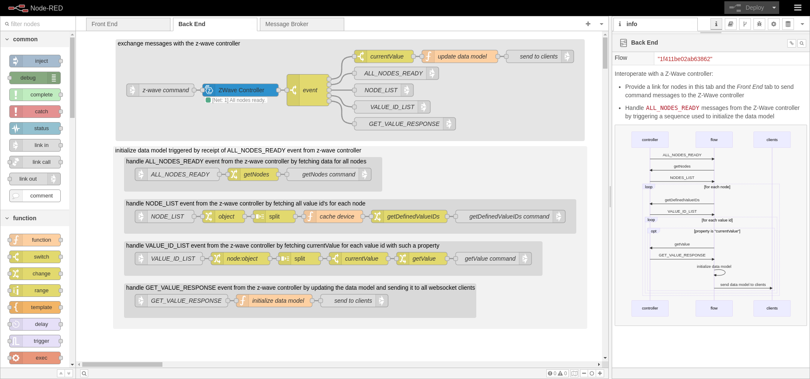
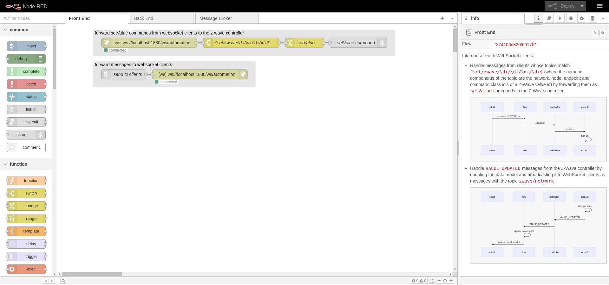
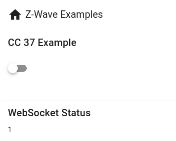
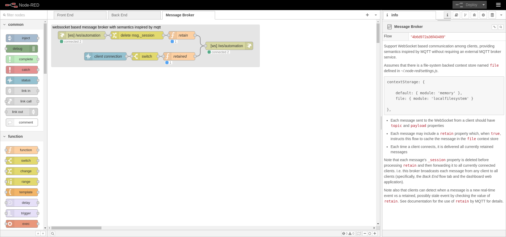
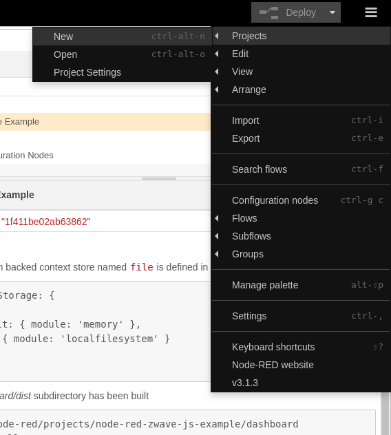
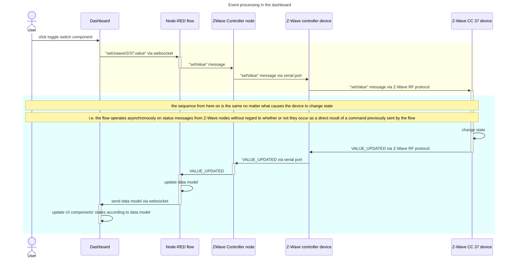
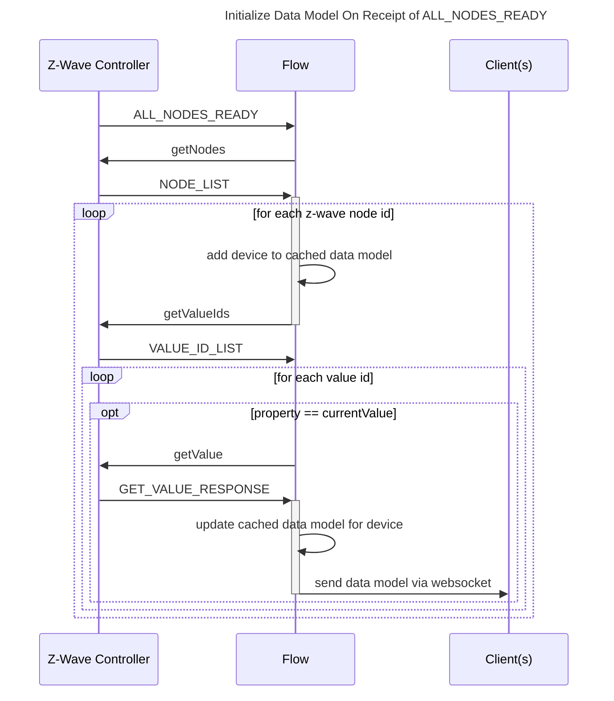

&copy; Copyright Kirk Rader 2024

# Z-Wave in Node-RED Using _node-red-contrib-zwave-js_

> _All links on this page were working as of December 15, 2023._

## About

> This documentation assumes familiarity with both Z-Wave and Node-RED
> terminology, concepts and procedures such as Z-Wave _value id_'s including
> _command class_ (often abbreviated CC), _node id_, _endpoint id_ and _network
> id_. The installation and configuration intructions assume you have a working
> Node-RED instance, a USB-based Z-Wave controller and at least one Z-Wave
> device that supports CC 37 (Z-Wave's _binary switch_ protocol). There is an
> unfortunate overlap in Node-RED's and Z-Wave's terminology using the word
> "node" to mean different things. A Node-RED _node_ is software component, a
> Z-Wave _node_ is a physical device. A Z-Wave _node id_ is an integer
> representing a particular device in a particular Z-Wave network, not to be
> confused with the _node id_ of a particular instance of a given type of
> Node-RED _node_ in a given flow.

This repository's contents demonstrate using
[node-red-contrib-zwave-js](<https://flows.nodered.org/node/node-red-contrib-zwave-js>)
to control a Z-Wave-enabled binary switch using a USB-based Z-Wave controller.

* Connect to Z-Wave enabled hardware using a _ZWave Controller_ node in Node-RED

  ```mermaid
  graph LR

    switch[Binary Switch]

    subgraph Client

        browser[Web Browser]

    end

    subgraph Raspberry Pi

        dongle[USB Z-Wave Controller]

        subgraph Node-RED

          subgraph Flow Tabs
            broker[Message Broker]
            frontend[Front End]
            backend[Back End]
          end

            subgraph node-red-contrib-zwave-js
                controller[ZWave Controller]
            end

            dashboard[Dashboard]

        end
    end

  browser <-- WebSocket --> broker
  broker <--> frontend
  frontend <--> backend
  backend <--> controller
  controller <-- Serial --> dongle
  dongle <-- z-wave --> switch
  browser <-- HTTP + JavaScript --> dashboard
  ```

* Data-driven back-end that operates by "discovering" the set of supported
  devices in the Z-Wave network

  

* Data-driven front end using a component framework,
  [Vuetify](https://vuetifyjs.com)

  

  <http://localhost:1880/zwave>

  

* Event-driven programming techniques using a WebSocket to communicate
  asynchronously between the front and back ends

  

A key feature of this flow is that one can add or remove devices in the Z-Wave
network without having to modify the front or back end implementation, so long
as the devices communicate using supported Z-Wave command classes (currently
only Command Class (CC) 37 for this tutorial).

The implementation of this tutorial flow and associated front-end logic support
devices that provide Z-Wave's binary switch (command class
37) protocol using `currentValue` and `targetValue` properties in the messages
they exchange with Node-RED using the _ZWave Controller_ type. This is done by
exploiting the similarity between the features and data models used by Z-Wave CC
37 devices and Vuetify's `v-switch` UI components. It would be reasonably
straightforward to extend this flow's approach to monitor and control additional
Z-Wave device types using corresponding types of Vuetify components, including
custom components designed to represent features of devices with more complex
behaviors.

### File and Directory Structure

This repository's contents is that of a standard Node-RED _project_ such that it
can be installed using the Node-RED UI for creating projects from Git
repositories.

In addition, it contains a subdirectory named _dashboard_ that contains a
Vuetify based web application. You can use Node-RED's normal UI for loading
projects from a GitHub repository. The process for also building and hosting the
Vuetify based front end web application is described [below](#installation).

## Dependencies

### Hardware

The hardware with which this flow was tested:

* [Raspberry Pi 4](https://www.raspberrypi.com/products/raspberry-pi-4-model-b)
* [Aeotec Z-Stick 7](https://aeotec.com/products/aeotec-z-stick-7/)
* [GE/Enbrighten Outdoor Switch](https://enbrightenme.com/enbrighten-z-wave-plug-outdoor-smart-switch)

### Software

> At the time of writing (January 2024) there is a known issue with the latest
> version of Node and the underlying NPM package used to support serial devices
> in Node-RED. The result is that if you use the exact software versions shown
> below you will need to restart the Node-RED process each time you deploy
> changes to any flow that uses serial ports, including
> _node-red-contrib-zwave-js_'s _ZWave Controller_ node. If you have configured
> Node-RED to run as a service in Raspberry Pi OS this can be done using the
> command:
>
> ```bash
> # do this after each deploy until and unless the serial port bug is fixed
> sudo systemctl restart nodered.service
> ```

The versions of software with which this flow was tested:

* [Raspberry Pi OS (bookworm)](https://www.raspberrypi.com/software)
* [Node (20.10.0)](https://github.com/nodesource/distributions)
* [Node-RED (3.1.3)](https://nodered.org)
* [node-red-contrib-zwave-js (9.0.3)](https://flows.nodered.org/node/node-red-contrib-zwave-js)
* [Vuetify (3.0.0)](https://vuetifyjs.com)
* [Chromium (120.0.6099.102)](https://www.chromium.org/chromium-projects)

## Installation

1. Make sure the _projects_ feature is enabled in _settings.js_:

   ```javascript
   projects: {
       /** To enable the Projects feature, set this value to true */
       enabled: true,
   ```

2. Add a file-system backed context store named `file` in _settings.js_:

   ```javascript
   contextStorage: {

      default: { module: 'memory' },
      file: { module: 'localfilesystem' }

   },
   ```

3. Add the dashboard path to the `httpStatic` section in _settings.js_:

   ```javascript
   httpStatic: [
        {
          path: '/home/<user>/.node-red/projects/node-red-zwave-js-example/dashboard/dist/',
          root: "/zwave/"
        }
   ]
   ```

   where `<user>` represents your user name

4. Restart the Node-RED process after making changes to
   _~/.node-red/settings.js_:

   ```bash
   sudo systemctl restart nodered.service
   ```

5. Install _node-red-contrib-zwave-js_ either through the palette manager UI in
   Node-RED or at the command line

   ```bash
   cd ~/.node-red
   npm install node-red-contrib-zwave-js
   ```

6. Create a new project by cloning this repository using the Node-RED user
   interface:

   

   Ignore any warnings about encrypted credentials; you'll need to supply your
   own configuration in any event

7. Build the dashboard:

   ```bash
   cd ~/.node-red/projects/node-red-zwave-js-example/dashboard
   npm install
   npm run build
   ```
8. Modify the configuration of the _ZWave Controller_ node to match your Z-Wave
   controller's serial port

You can verify that everything is running correctly using the toggle switch on
the dashboard web page. Toggling in the dashboard should turn on and off your
physical switch. Manually turning on and off the phsical switch should cause the
dashboard toggle to change state accordingly. You might notice some delay
between physical state change events and updates in the dashboard. This is
unavoidable due to network latencies and processing overhead.

## Features

The features demonstrated by this flow are:

* The ability to communicate with Z-Wave nodes through a hard-coded reference to
  a particular controller node

* The ability to discover, monitor and control Z-Wave binary switches (nodes
  that support command class 37) in a Node-RED based back end

* The ability to provide a data-driven HTML5 based user interface using a
  WebSocket for communication between front and back ends that adapts
  automatically to the set of devices discovered by the back end

## Details

> Note that Node-RED is used as the web server for the dashboard in order to
> make this tutorial project as self-contained as possible. The dashboard web
> application has no server side code nor any dependency on Node-RED other than
> as a web socket client. It could run in any web server with network access to
> the Node-RED server running this project's flow.

### WebSocket Based Event Driven Design

The overall approach used in this example is event-driven using a Z-Wave
controller and a WebSocket. The Websocket protocol is used rather than MQTT both
to make this example as entirely self-contained as possible and, more
importantly, for compatibility with browser-based web applications e.g. the home
automation user interface implemented as a part of this project.

The flow listens for commands arriving at a _websocket in_ node and sends state
change event messages to a corresponding _websocket out_ node. Other components
such as the home automation dashboard web application can connect to that web
socket to exchange messages with the _ZWave Controller_ as demonstrated by the
very basic web application that is part of this tutorial project.

When a Z-Wave device changes state, whether as a result of receiving a command
from this flow or by other operations within the Z-Wave network, it transmits a
status message over the Z-Wave network which is received by the Z-Wave
controller. That causes the controller to emit a message from the serial port to
which the _ZWave Controller_ node is listening in Node-RED. In this example,
messages which report the current value of a binary switch (command class 37)
used to update an in-memory data model of the current state of all Z-Wave
devices, which is then forwarded to the _websocket out_ node for processing by a
client such as this project's dashboard web application.

Client applications can send command messages to the WebSocket to which the flow
is listening, such as when a user toggles the _v-switch_ representing a
particular binary switch device. The flow handles such commands by tranforming
them into the format required as input to the _ZWave Controller_ node. The
_ZWave Controller_ node then sends the command message via the USB stick's
serial interface to the Z-Wave network. If all goes well, the targeted device
will respond to the command by reporting the change to its current state as a
status message over the Z-Wave network, which closes the loop of keeping the
data model in sync with the physical devices.

There is a slight but sometimes noticable delay between sending a command
message and receiving one indicating the corresponding change of device state.
This delay is caused by the overhead of the various processing steps and latency
in both WebSocket and Z-Wave network communication. But it also means that
external systems can be confident in the actual state of the devices in the
Z-Wave network based on those devices' own reporting rather than relying on
assumptions based on optimistically updating the data model to match the values
in commands without waiting for confirmation that the asynchronous commands were
properly executed.



Other interactions between the front and back ends are variations on the
preceding sequence. For example, as noted in the preceding sequence diagram, the
flow sends the updated data model to connected clients each time it receives an
asynchronous status change message from the Z-Wave network no matter what caused
a given device's state to change.

The data model is initially created each time the flow starts by handling "all
nodes ready" messages from the _ZWave Controller_ node:



### Message Broker

The user is not a participant in the immediately preceding flow since it is
triggered by direct interactions between Node-RED nodes in the back end. This
begs the question of how the data model is delivered to the dashboard when it
might not even have yet been launched when the data model is first constructed?

The interactions labeled "send data model via websocket" in the preceding
sequences are actually quite oversimplified to keep the diagrams readable. This
tutorial flow uses Node-RED's context storage to implement a WebSocket-based
message broker with semantics inspired by MQTT. Each message sent via the broker
must include both `topic` and `payload` attributes. The `topic` strings are used
to classify and route messages while any data associated with a given `topic` is
contained in the `payload`. In addition, a `retain` attribute can optionally be
included. When `retain` is `true`, the broker stores the message in the flow's
context as well as forwarding it to all currently connected clients. When a
client subsequently connects, it is immediately sent all currently retained
messages. The general pattern in this flow is that messages containing the data
model sent from the back end have `retain` set to `true` while command messages
sent from the front end have `retain` omitted or set to `false`. That way, the
current state of the data model is shared among all clients, no matter when or
in what order they connect, while commands are only handled by currently
connected listeners in real time.
