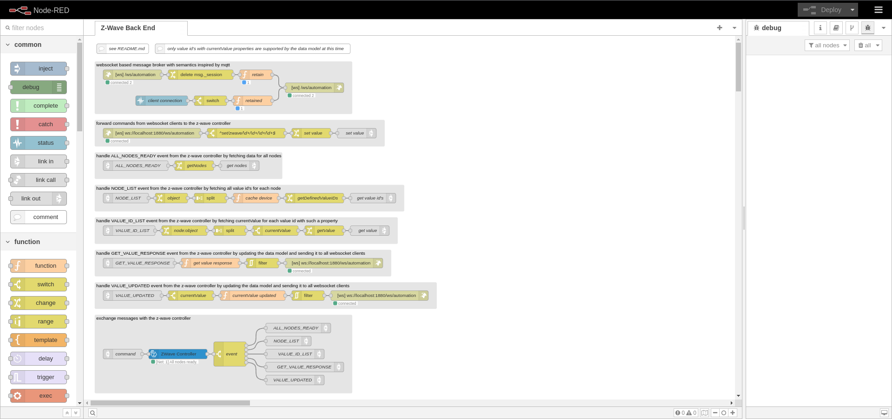
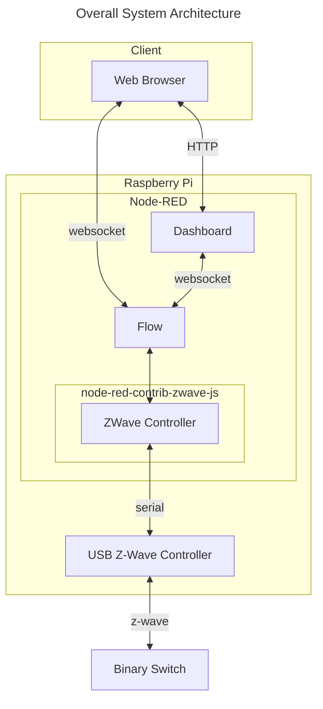
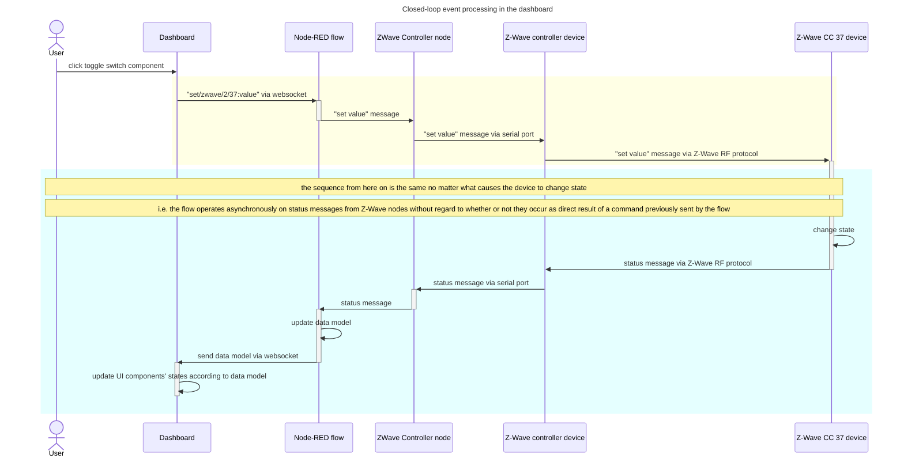
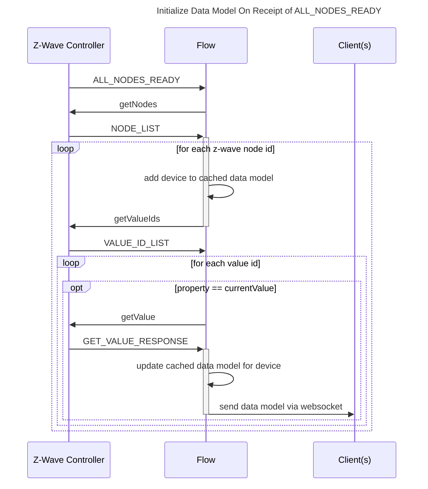

&copy; Copyright Kirk Rader 2023

# Z-Wave in Node-RED Using _node-red-contrib-zwave-js_

> _All links on this page were working as of December 15, 2023._



## About

Demonstrate using
[node-red-contrib-zwave-js](<https://flows.nodered.org/node/node-red-contrib-zwave-js>)
to control a Z-Wave-enabled switch using a USB-based Z-Wave controller.

* Connect to Z-Wave enabled hardware using a _ZWave Controller_ node

* Event-driven programming techniques using a WebSocket to communicate
  asynchronously between the front and back ends

* Data-driven front end using a component framework,
  [Vuetify](https://vuetifyjs.com)

A key feature of this flow is that one can add or remove devices in the Z-Wave
network without having to modify the front or back end implementation, so long
as the devices communicate using supported Z-Wave command classes (currently
only CC 37 for this tutorial).

This flow deliberately departs from many of the recommendations in the
documentation for _node-red-contrib-zwave-js_. It uses neither
_CMD&nbsp;Factory_ nor _Event&nbsp;Filter_ nodes. In fact, the only type of node
from _node-red-cotrib-zwave-js_ used is _ZWave Controller_. The decision only to
use the _ZWave&nbsp;Controller_ type was made consciously so as to facilitate
creating and managing a Vuetify-based dashboard in a data-driven fashion. There
are no hard-coded Z-Wave node id's in the front or back end. Specific Z-Wave
property types and command classes are referenced only so as to determine
whether and how to represent a given Z-Wave device in the data model and render
it in the front end. "Going with the flow" (pun intended) of how
_node-red-contrib-zwave-js_ is designed would have resulted in a flow that was
easier to create than this one, but which would have been very fragile by
comparison when devices are added or removed from the Z-Wave network. The
approach demonstrated here automatically adapts to devices being added or
removed using the Z-Wave controller user interface, without requiring
modification to the front and back end data model and logic for each Z-Wave
binary switch device added or removed. In other words, the design of this flow
trades a less intuitive up-front design in exchange for greater flexibility and
maintainability over time.

Specifically, the implementation of this tutorial flow and associated front-end
logic support devices that provide Z-Wave's binary switch (command class
37) protocol using _currentValue_ and _targetValue_ properties in the messages
they exchange with _Node-RED_ using the _ZWave Controller_ type. This is done by
exploiting the similarity between the features and data models used by Z-Wave CC
37 devices and Vuetify's _v-switch_ UI components. It would be reasonably
straightforward to extend this flow's approach to monitor and control additional
Z-Wave device types using corresponding types of Vuetify components.

> Vuetify is used in this flow to demonstrate the relationship between the data
> model implemented in _Node-RED_ and components of such a framework. The data
> model for a binary switch is so simple that it could have just as easily be
> represented using native HTML5 entities such as check boxes rather than
> _v-switch_ components. The expectation is that gear with more complex
> behavior, e.g. a thermostat that appears as a composite Z-Wave node with
> multiple command classes of various underlying data types, would be
> implemented by application-specific, custom Vuetify components the
> implementation of which is beyond the scope of this tutorial but a natural
> extension from it.

## File and Directory Structure

This repository's file structure is that of a standard _Node-RED_ "project" such
that it can be installed using the _Node-RED_ UI for creating projects from Git
repositories. In addition, it contains a subdirectory named _dashboard_ that
contains a Vuetify project. You can use _Node-RED_'s normal UI for loading
projects from a GitHub repository. The process for also building and hosting the
Vuetify based front end web application is described [below](#installation).

## Dependencies

### Hardware

The hardware with which this flow was tested:

| Product                      | URL                                                                    |
|------------------------------|------------------------------------------------------------------------|
| Raspberry Pi 4               | <https://www.raspberrypi.com/products/raspberry-pi-4-model-b/>         |
| Aeotec Z-Stick 7             | <https://aeotec.com/products/aeotec-z-stick-7/>                        |
| GE/Enbrighten Outdoor Switch | <https://enbrightenme.com/enbrighten-z-wave-plug-outdoor-smart-switch> |

### Software

> Note that at the time of writing in December 2023 there is some
> incompatibility among the latest versions of _Raspberry Pi OS_, _Node_, and
> _Node-RED_ such that once _Node-RED_ opens a serial port the _Node-RED_
> process must be restarted, e.g. using
> `sudo&nbsp;systemctl&nbsp;restart&nbsp;nodered.service`, every time changes to
> the flow are saved or else the node using the serial port will receive a run
> time error indicating that the port is in use, even though it is the
> _Node-RED_ process which holds the lock. This bug occurs not only with the
> _node-red-contrib-zwave-js_ package but also with native _serial in_ and
> _serial out_ nodes so it is very likely a regression introduced by later
> versions of _Raspberry Pi OS_ or _Node_ than those which are officially
> supported by _Node-RED_.

The versions of software with which this flow was tested:

| Product                           | URL                                                        |
|-----------------------------------|------------------------------------------------------------|
| Raspberry Pi OS (bookworm)        | <https://www.raspberrypi.com/software/>                    |
| Node (20.10.0)                    | <https://github.com/nodesource/distributions>              |
| Node-RED (3.1.3)                  | <https://nodered.org>                                      |
| node-red-contrib-zwave-js (9.0.3) | <https://flows.nodered.org/node/node-red-contrib-zwave-js> |
| Vuetify (3.0.0)                   | <https://vuetifyjs.com>                                    |
| Chromium (120.0.6099.102)         | <https://www.chromium.org/chromium-projects/>              |

## Installation

1. Make sure the _projects_ feature is enabled in _settings.js_:

   ```javascript
   projects: {
       /** To enable the Projects feature, set this value to true */
       enabled: true,
   ```

2. Add a file-system backed context store named `file` in _settings.js_:

   ```javascript
   contextStorage: {

      default: { module: 'memory' },
      file: { module: 'localfilesystem' }

   },
   ```

3. Install _node-red-contrib-zwave-js_ either throug the palette manager UI in
   _Node-RED_ or at the command line

   ```bash
   cd ~/.node-red
   npm install node-red-contrib-zwave-js
   ```

4. Create a new project by cloning this repository using the _Node-RED_ user
   interface:

   * Ignore any warnings about encrypted credentials; you'll need to supply your
     own configuration in any event

5. Build the dashboard:

   ```bash
   cd ~/.node-red/projects/node-red-zwave-js-example/dashboard
   npm install
   npm run build
   ```

6. Add the dashboard path to the `httpStatic` section in _settings.js_:

   ```javascript
   httpStatic: [
    //    {path: '/home/nol/pics/',    root: "/img/"}, 
    //    {path: '/home/nol/reports/', root: "/doc/"}, 
        {
          path: '/home/<user>/.node-red/projects/z-wave/dashboard/dist/',
          root: "/zwave/"
        }
   ]
   ```

   where `<user>` represents your user name

7. Restart _Node-RED_, e.g. if it is configured to run as a daemon:

   ```bash
   sudo systtemctl restart nodered.service
   ```

8. Modify the configuration of the _ZWave Controller_ node to match your Z-Wave
   controller's serial port

> (Note: If you are just starting out with Z-Wave and using this flow to perform
> the initial configuration of your Z-Wave gear, see the
> [_node-red-contrib-zwave-js_](https://flows.nodered.org/node/node-red-contrib-zwave-js)
> documentation for how to use its user interface for configuring the controller
> node and including device nodes in your Z-Wave network. All that is required
> is at least one command class 37 (see below) device whose Z-Wave node id must
> be set in the _ZWave Device_ Node-RED node.)

Once all of the preceding configuration is complete, you should be able to
browse to the dashboard by appending `/zwave` to your _Node-RED_ editor URL,
e.g. <http://localhost:1880/zwave>.


You can verify that everything is running correctly using the toggle switch on
the dashboard web page. Toggling in the dashboard should turn on and off your
physical switch. Manually turning on and off the phsical switch should cause the
dashboard toggle to change state accordingly. You might notice some delay
between physical state change events and updates in the dashboard. This is
unavoidable due to network latencies and processing overhead.

## Features

The features demonstrated by this flow are:

* The ability to communicate with Z-Wave nodes through a hard-coded reference to
  a particular controller node

* The ability to discover, monitor and control Z-Wave binary switches within
  _Node-RED_ by way of a HTML5 based user interface using a WebSocket for
  communication between front and back ends

## Details



> Note that _Node-RED_ is used as the web server for the dashboard in order to
> make this tutorial project as self-contained as possible. The dashboard web
> application has no server side code nor any dependency on _Node-RED_ other
> than as a web socket client. It could run in any web server with network
> access to the _Node-RED_ server running this project's flow.

### WebSocket Based Event Driven Design

The overall approach used in this example is event-driven using a Z-Wave
controller and a WebSocket. The Websocket protocol is used rather than MQTT both
to make this example as entirely self-contained as possible and, more
importantly, for compatibility with browser-based web applications e.g. the home
automation user interface implemented as a part of this project.

The flow listens for commands arriving at a _websocket in_ node and sends state
change event messages to a corresponding _websocket out_ node. Other components
such as the home automation dashboard web application can connect to that web
socket to exchange messages with the _ZWave Controller_ as demonstrated by the
very basic web application that is part of this tutorial project.

When a Z-Wave device changes state, whether as a result of receiving a command
from this flow or by other operations within the Z-Wave network, it transmits a
status message over the Z-Wave network which is received by the Z-Wave
controller. That causes the controller to emit a message from the serial port to
which the _ZWave Controller_ node is listening in _Node-RED_. In this example,
messages which report the current value of a binary switch (command class 37)
used to update an in-memory data model of the current state of all Z-Wave
devices, which is then forwarded to the _websocket out_ node for processing by a
client such as this project's dashboard web application.

Client applications can send command messages to the WebSocket to which the flow
is listening, such as when a user toggles the _v-switch_ representing a
particular binary switch device. The flow handles such commands by tranforming
them into the format required as input to the _ZWave Controller_ node. The
_ZWave Controller_ node then sends the command message via the USB stick's
serial interface to the Z-Wave network. If all goes well, the targeted device
will respond to the command by reporting the change to its current state as a
status message over the Z-Wave network, which closes the loop of keeping the
data model in sync with the physical devices.

There is a slight but sometimes noticable delay between sending a command
message and receiving one indicating the corresponding change of device state.
This delay is caused by the overhead of the various processing steps and latency
in both WebSocket and Z-Wave network communication. But it also means that
external systems can be confident in the actual state of the devices in the
Z-Wave network based on those devices' own reporting rather than relying on
assumptions based on optimistically updating the data model to match the values
in commands without waiting for confirmation that the asynchronous commands were
properly executed.



Other interactions between the front and back ends are variations on the
preceding sequence. For example, as noted in the preceding sequence diagram, the
flow sends the updated data model to connected clients each time it receives an
asynchronous status change message from the Z-Wave network no matter what caused
a given device's state to change.

The data model is initially created each time the flow starts by handling "all
nodes ready" messages from the _ZWave Controller_ node:



### Message Broker

The user is not a participant in the immediately preceding flow since it is
triggered by direct interactions between _Node-RED_ nodes in the back end. This
begs the question of how the data model is delivered to the dashboard when it
might not even have yet been launched when the data model is first constructed?

The interactions labeled "send data model via websocket" in the preceding
sequences are actually quite oversimplified to keep the diagrams readable. This
tutorial flow uses _Node-RED_'s context storage to implement a WebSocket-based
message broker with semantics inspired by MQTT. Each message sent via the broker
must include both `topic` and `payload` attributes. The `topic` strings are used
to classify and route messages while any data associated with a given `topic` is
contained in the `payload`. In addition, a `retain` attribute can optionally be
included. When `retain` is `true`, the broker stores the message in the flow's
context as well as forwarding it to all currently connected clients. When a
client subsequently connects, it is immediately sent all currently retained
messages. The general pattern in this flow is that messages containing the data
model sent from the back end have `retain` set to `true` while command messages
sent from the front end have `retain` omitted or set to `false`. That way, the
current state of the data model is shared among all clients, no matter when or
in what order they connect, while commands are only handled by currently
connected listeners in real time.
