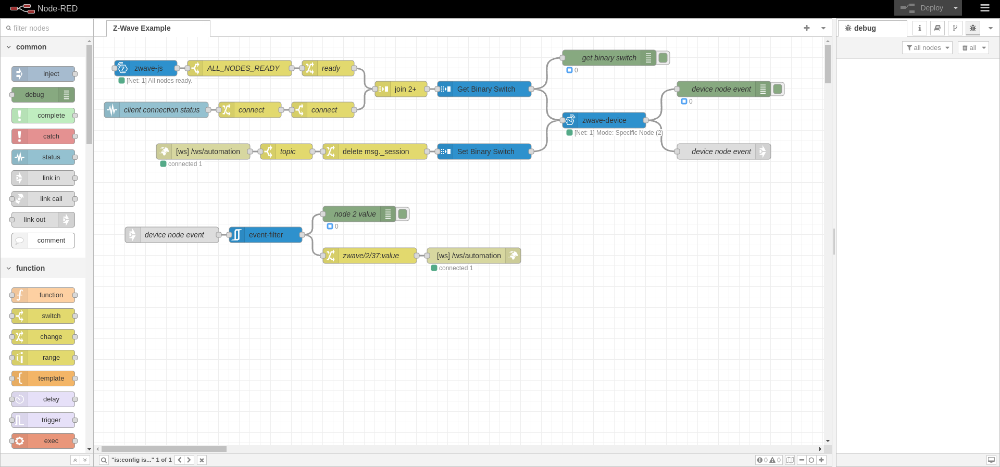
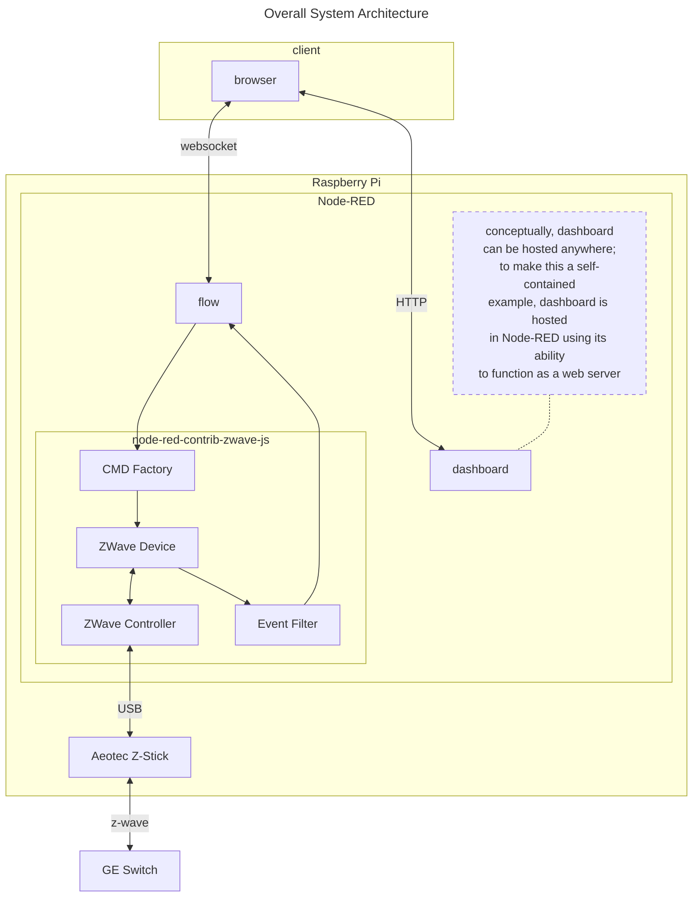
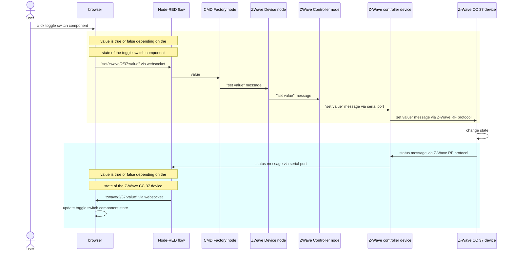
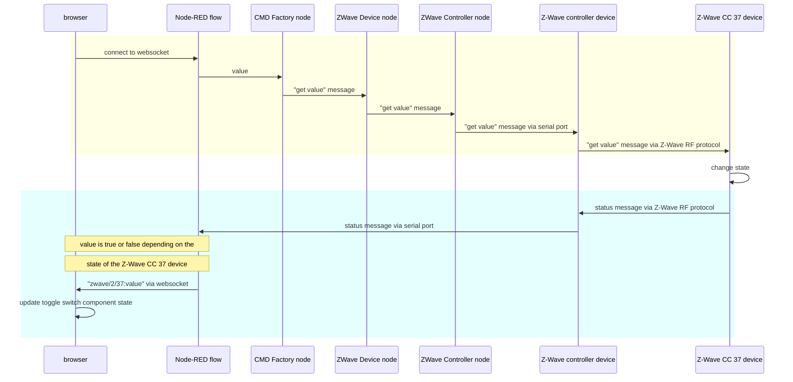

&copy; Copyright Kirk Rader 2023

# Z-Wave in Node-RED Using _node-red-contrib-zwave-js_

[Note: all links on this page were working as of December 15, 2023.]



## About

Demonstrate using
[node-red-contrib-zwave-js](<https://flows.nodered.org/node/node-red-contrib-zwave-js>)
to control a Z-Wave-enabled switch using a USB-based Z-Wave controller.

* Connect to the controller using a _Zwave Controller_ node

* Send commands to control the state of a binary switch (command class 37) using
  a combination of _CMD Factory_ and _ZWave Device_ nodes

* Receive asynchronous events when the state of the binary switch changes using
  a combination of _ZWave Device_ and _Event Filter_ nodes

* Integrate with a HTML5-based dashboard using a websocket for communication
  with _Node-RED_ and [Vuetify](https://vuetifyjs.com) web UI components

This _README.md_ is not a Z-Wave tutorial. It assumes familiarity with
_Node-RED_ and Z-Wave terminology and concepts. It assumes you have a working
Z-Wave controller that appears to your _Node-RED_ server machine as a serial
device along with at least once Z-Wave enabled binary switch (command class 37)
device and that you know what that device's Z-Wave node id is.

## Dependencies

### Hardware

The hardware with which this flow was tested:

| Product                      | URL                                                                    |
|------------------------------|------------------------------------------------------------------------|
| Raspberry Pi 4               | <https://www.raspberrypi.com/products/raspberry-pi-4-model-b/>         |
| Aeotec Z-Stick 7             | <https://aeotec.com/products/aeotec-z-stick-7/>                        |
| GE/Enbrighten Outdoor Switch | <https://enbrightenme.com/enbrighten-z-wave-plug-outdoor-smart-switch> |

Any computer suppoted by Node-RED should work. Any Z-Wave controller compatible
with _node-red-contrib-zwave-js_ should work, as should any Z-Wave device that
supports the Z-Wave binary switch (command class 37) protocol.

### Software

(Note that at the time of writing in December 2023 there is some incompatibility
among the latest versions of _Raspberry Pi OS_, _Node_, and _Node-RED_ such that
once _Node-RED_ opens a serial port the _Node-RED_ process must be restarted,
e.g. using `sudo systemctl restart nodered.service`, every time changes to the
flow are saved or else the node using the serial port will receive a run time
error indicating that the port is in use, even though it is _Node-RED_ which has
it locked. This bug occurs not only with the _node-red-contrib-zwave-js_ package
but also with native _serial in_ and _serial out_ nodes.)

The versions of software with which this flow was tested:

| Component                         | URL                                                        |
|-----------------------------------|------------------------------------------------------------|
| Raspberry Pi OS (bookworm)        | <https://www.raspberrypi.com/software/>                    |
| Node (20.10.0)                    | <https://github.com/nodesource/distributions>              |
| Node-RED (3.1.3)                  | <https://nodered.org>                                      |
| node-red-contrib-zwave-js (9.0.3) | <https://flows.nodered.org/node/node-red-contrib-zwave-js> |
| Vuetify (3.0.0)                   | <https://vuetifyjs.com>                                    |

## Installation

1. Make sure the _projects_ feature is enabled in _settings.js_:

   ```javascript
   projects: {
       /** To enable the Projects feature, set this value to true */
       enabled: true,
   ```

2. Create a new project by cloning this repository using the _Node-RED_ user
   interface:

   * Ignore any warnings about encrypted credentials; you'll need to supply your
     own configuration in any event
   
3. Build the dashboard:

   ```bash
   cd ~/.node-red/projects/node-red-zwave-js-example/dashboard
   npm install
   npm run build
   ```

4. Add the dashboard path to the `httpStatic` section in _settings.js_:

   ```javascript
   httpStatic: [
    //    {path: '/home/nol/pics/',    root: "/img/"}, 
    //    {path: '/home/nol/reports/', root: "/doc/"}, 
        {
          path: '/home/<user>/.node-red/projects/z-wave/dashboard/dist/',
          root: "/zwave/"
        }
   ]
   ```

   where `<user>` represents your user name

5. Restart _Node-RED_, e.g. if it is configured to run as a daemon:

   ```bash
   sudo systtemctl restart nodered.service
   ```

6. Modify the configuration of the various WebSocket and
   _node-red-contrib-zwave-js_ nodes in _Node-RED_ to match your local setup.

   * Change the serial port device name in the _ZWave Controller_ node to your
     controller's port

   * Change the Z-Wave node id in the _ZWave Device_ node in _Node-RED_ to your
     binary switch's Z-Wave node id (any device should work so long as it
     supports command class 37)

> (Note: If you are just starting out with Z-Wave and using this flow to perform
> the initial configuration of your Z-Wave gear, see the
> [_node-red-contrib-zwave-js_](https://flows.nodered.org/node/node-red-contrib-zwave-js)
> documentation for how to use its user interface for configuring the controller
> node and including device nodes in your Z-Wave network. All that is required
> is one command class 37 (see below) device whose Z-Wave node id must be set in
> the _ZWave Device_ Node-RED node.)

Once all of the preceding configuration is complete, you should be able to
browse to the dashboard by appending `/zwave` to your _Node-RED_ editor URL,
e.g. <http://localhost:1880/zwave>.


You can verify that everything is running correctly using the toggle switch on
the dashboard web page. Toggling in the dashboard should turn on and off your
physical switch. Manually turning on and off the phsical switch should cause the
dashboard toggle to change state accordingly. You might notice some delay
between physical state change events and updates in the dashboard. This is
unavoidable due to network latencies and processing overhead.

## Features

The features demonstrated by this flow are:

* The ability to communicate with Z-Wave nodes through a hard-coded reference to
  a particular controller node

* The ability to monitor and control a particular Z-Wave binary switch using
  hard-coded references to its Z-Wave node id and Command Class (CC).

* The ability to integrate Z-Wave monitoring and control within _Node-RED_ with
  a HTML5 based user interface using a WebSocket

## Details



### WebSocket Based Event Driven Design

The overall approach used in this example is event-driven using a Z-Wave
controller and a WebSocket. (Websocket is used rather than MQTT both to make
this example entirely self-contained but, more importantly, for compatibility
with browser-based web applications e.g. a home automation user interface.) The
flow listens for commands to send to a _ZWave Device_ node arriving at a
_websocket in_ node and sends the output of that _ZWave Device_ node to a
corresponding _websocket out_ node. Other components such as a home automation
dashboard web application can connect to that web socket to exchange messages
with the _ZWave Device_ as demonstrated by the very basic web application that
is part of this tutorial project.

When a Z-Wave device changes state, whether as a result of receiving a command
from this flow or by other operations within the Z-Wave network, it transmits a
status message which is received by the Z-Wave controller. That causes it to
emit a message from the serial port to which the _ZWave Controller_ node is
listening. That message is then forwarded to the output of the corresponding
_ZWave Device_ node and from there to an _Event Filter_ node. The _Event Filter_
only passes through those messages which match its configuration. In this
example, messages which report the current value of the binary switch (command
code 37) are forwarded to the _websocket out_ node for processing by a client
such as this project's dashboard web application.

There can be a slight but sometimes noticable delay between sending a command
message and receiving one indicating the corresponding change of device state.
This delay is caused by the overhead of the various processing steps and latency
in both WebSocket and Z-Wave network communication. But it also means that
external systems can be confident in the actual state of the devices in the
Z-Wave network based on those devices' own reporting rather than relying on
assumptions based on the values in commands sent to them asynchronously.



## Summary

* The _ZWave Controller_ node named `Controller` is the singleton which
  communicates between _Node-RED_ and the Z-Wave mesh network

* The _CMD Factory_ nodes each formats a particular type of message to send to a
  binary switch (CC 37)

* The _ZWave Device_ node provides the _Node-RED_ model for a partiular Z-Wave
  device with Z-Wave specified by its node id

* The _Event Filter_ node passes only CC 37 value messages through for
  subsequent processing by the _Node-RED_ flow, ignoring any other types of
  messages the node might emit

* The status of the _websocket in_ and _ZWave Controller_ nodes are monitored
  for client connection events

  * The the _status_ node's output is joined with the `ALL_NODES_READY` status
    from the _ZWave Controller_

  * Each time a client connects to the WebSocket after all nodes are ready, the
    _ZWave Device_ node is sent a command requesting that it send its current
    value for CC 37

  * On receipt of that command message, the Z-Wave device will send a CC 37
    status

* While connected to the WebSocket:

   * Each client will receive CC 37 value messages from the _ZWave Device_ node
     from the WebSocket

   * Command messages each client sends to the WebSocket will be forwarded to
     the _ZWave Device_

Here is the sequence when a client connects; note that it is nearly identical as
the preceding for a user interacting with the web application:


